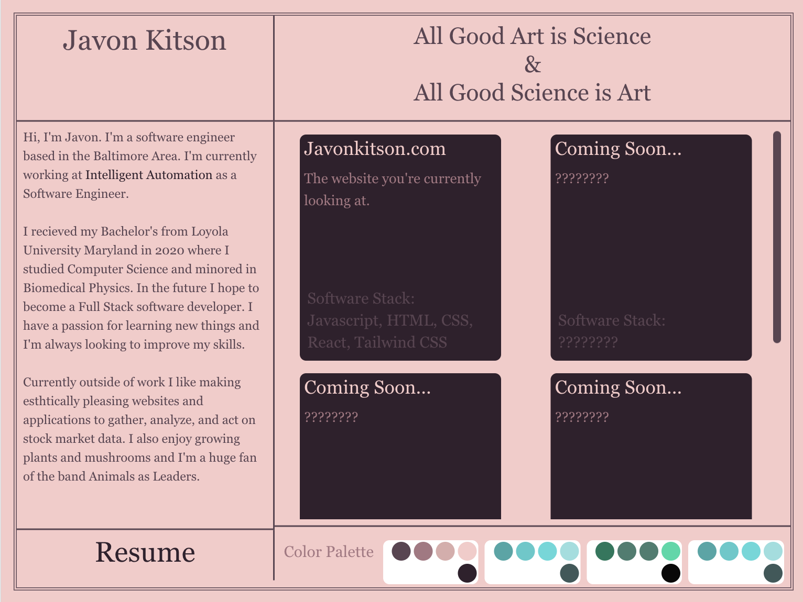
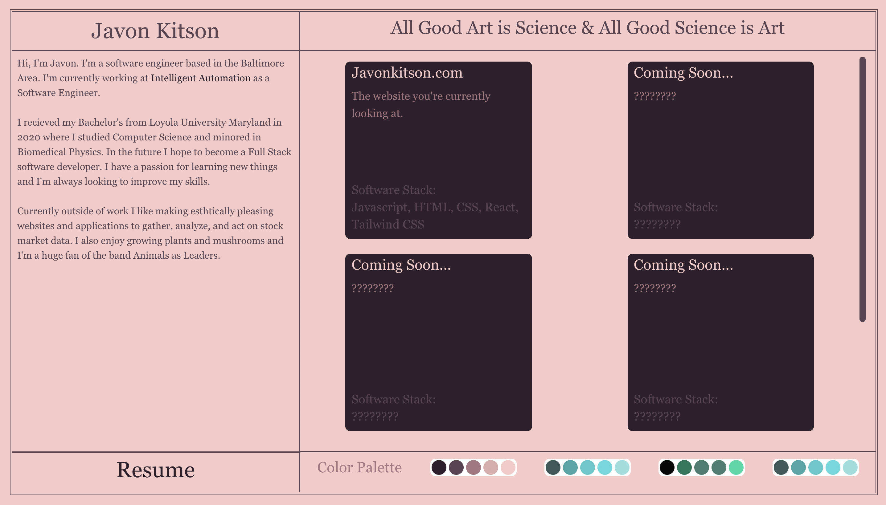
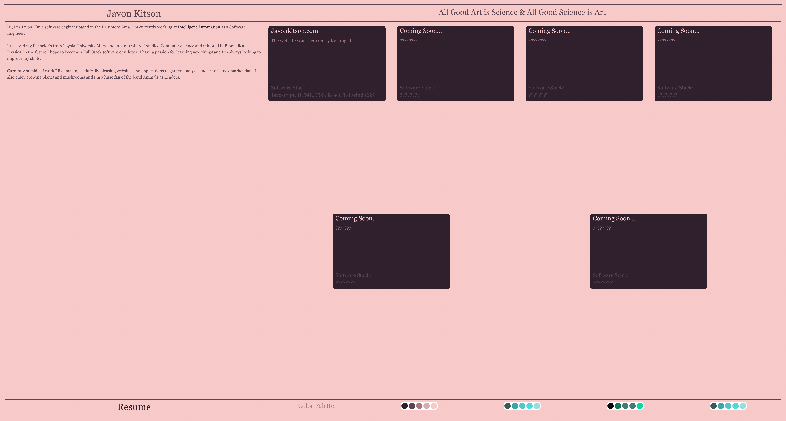

# javonkitson.com

This project showcases not only my web development skills but also my proficiency in DevOps. The site is automatically tested, linted, and deployed through a CI/CD pipeline, ensuring code quality and seamless updates.

This project was bootstrapped with [Create React App](https://github.com/facebook/create-react-app).

## Technologies Used

- [Create React App](https://github.com/facebook/create-react-app)
- [Tailwind CSS](https://tailwindui.com/)
- [Jest](https://jestjs.io/)
- [Eslint](https://eslint.org/)
- [Gitlab CI](https://docs.gitlab.com/ee/ci/) 

## CI/CD Pipeline

The project is configured with a GitLab CI/CD pipeline that automates the process of testing, linting, and deploying. When changes are pushed to the Git repository:

1. **Testing**: Jest is used to run all unit tests.
2. **Linting**: ESLint checks the code for any syntactical or stylistic errors.
3. **Deployment**: If all tests pass and the linter is satisfied, the code is then deployed to the live site.

This setup ensures that the website is consistently stable, efficient, and up-to-date with the latest changes.

## Development Scripts

In the project directory, you can run:

### `yarn start`

Runs the app in the development mode.\
Open [http://localhost:3000](http://localhost:3000) to view it in the browser.

The page will reload if you make edits.\
You will also see any lint errors in the console.

### `yarn test`

Launches the test runner in the interactive watch mode.

### `yarn build`

Builds the app for production to the `build` folder.\
It correctly bundles React in production mode and optimizes the build for the best performance.

The build is minified and the filenames include the hashes.\
Your app is ready to be deployed!

### `yarn lint`

Runs the ESLint configureation at the root directory.\
Eslint is a static code analysis tool for identifying problematic patterns found in JavaScript code.

### `yarn eject`

**Note: this is a one-way operation. Once you `eject`, you can’t go back!**

If you aren’t satisfied with the build tool and configuration choices, you can `eject` at any time. This command will remove the single build dependency from your project.

Instead, it will copy all the configuration files and the transitive dependencies (webpack, Babel, ESLint, etc) right into your project so you have full control over them. All of the commands except `eject` will still work, but they will point to the copied scripts so you can tweak them. At this point you’re on your own.

You don’t have to ever use `eject`. The curated feature set is suitable for small and middle deployments, and you shouldn’t feel obligated to use this feature. However we understand that this tool wouldn’t be useful if you couldn’t customize it when you are ready for it.

## Screenshots

### Mobile

### Tablet

### Desktop

### Desktop Large (4k)

## Project Status

I've been continuously working on this website as I notice style errors or as I add more projects to my portfolio. The automated CI/CD pipeline ensures that these updates are immediately reflected on the live site without manual intervention.

---

This way, visitors to your GitHub/GitLab repository not only see the technologies you're using but also understand how you're leveraging DevOps practices.